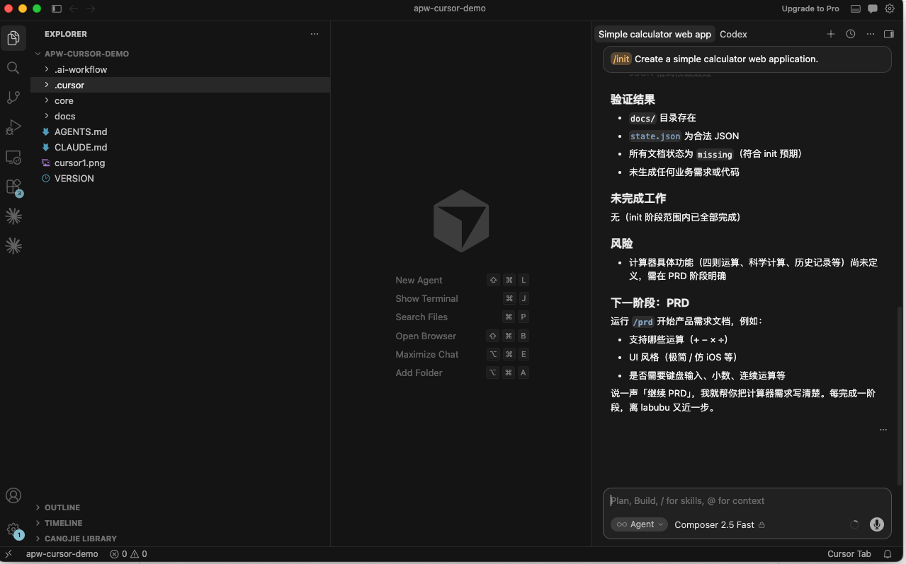
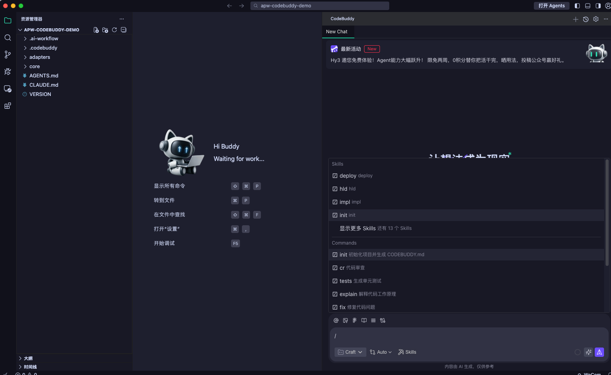

# AI Project Workflow

[](https://github.com/AlanHuang168/AI-Project-Workflow/actions/workflows/ci.yml)
[](https://www.npmjs.com/package/@dayahs/ai-project-workflow)
[](./LICENSE)

[中文文档](./README.zh-CN.md)

A universal, AI-native software delivery workflow for Cursor, Claude Code, Codex, Qoder, CodeBuddy, CatPaw, TRAE, and other AI coding assistants. One canonical `core/` source, lightweight adapters per tool, a state file that tracks progress, and a CLI that installs and validates everything.

## Why

AI coding agents rush into implementation while requirements, architecture, design, and tests are still unclear. The result is code nobody asked for, silent scope creep, and "all tests pass" reports for tests that never ran.

AI Project Workflow makes delivery explicit:

- Every stage has a Skill contract: preconditions, allowed changes, outputs, and stop conditions.
- Every deliverable is written to a file under `docs/`, never only printed in chat.
- Progress is tracked in `.ai-workflow/state.json` and gated stage by stage.
- Verification must be reported honestly: commands actually executed, real results, remaining risks.

## How it works

```text
                core/  (single canonical source)
                ├── rules/       global working rules
                ├── skills/      one contract per stage
                ├── agents/      role definitions
                ├── templates/   document skeletons
                └── schemas/     state file schema
                        |
        apw init <target> --platform <tool>
                        v
    your-project/
    ├── AGENTS.md, CLAUDE.md            entry points read by the AI tool
    ├── .cursor/ or .trae/ or ...       adapter files where your tool loads them
    └── .ai-workflow/                   everything APW-internal
        ├── VERSION
        ├── state.json                  workflow state
        ├── project.yaml                optional custom stage order
        ├── runtime/                    skills, rules, templates, schemas, agents
        └── adapters/                   platform notes
```

APW stores its runtime under `.ai-workflow/` to keep the project root clean while remaining backward compatible with legacy layouts.

After installation, the project root only keeps the files your AI tool needs to discover automatically. APW's internal runtime, state, version, and adapter notes live under the hidden `.ai-workflow/` directory:

```text
your-project/
├── AGENTS.md                 shared AI working rules
├── CLAUDE.md                 Claude-compatible entry point
├── docs/                     stage deliverables written by the workflow
├── .cursor/ .catpaw/ ...     platform-specific adapter files
└── .ai-workflow/             hidden APW runtime directory
    ├── VERSION               installed APW package version
    ├── state.json            current stage and completed stages
    ├── project.yaml          optional custom workflow config
    ├── runtime/              installed rules, Skills, agents, templates, schemas
    └── adapters/             platform notes for non-dot-directory adapters
```

Older projects that still have root-level `core/` or `VERSION` remain valid: APW checks `.ai-workflow/` first and falls back to the legacy layout when needed.

Enforcement is prompt-based. The adapter instructs the AI agent to read the active Skill, verify upstream documents, and update the state file before moving on. The CLI verifies the files (`apw validate`, `apw status`); the agent follows the contract because every entry point tells it to. If an agent drifts, point it back to `AGENTS.md`.

> New to Node.js or command-line tools?
> Read the [Beginner Installation Guide](./docs/getting-started/beginner-guide.md).
> It walks through installing Node.js, opening a terminal, and running your first `apw init` command step by step.

## Quick start

```bash
npx @dayahs/ai-project-workflow init . --platform cursor
```

Or install globally:

```bash
npm install -g @dayahs/ai-project-workflow
apw init my-app --platform cursor
```

Supported platforms: `cursor`, `trae`, `qoder`, `codebuddy`, `catpaw`, `claude-code`, `codex`, `all`.

## Verified platforms

| Platform | Status | Evidence |
| -------- | ------ | -------- |
| Cursor | ✅ Verified | [Report](./docs/testing/cursor.md) |
| Claude Code | ✅ Verified | [Report](./docs/testing/claude-code.md) |
| Codex CLI | ✅ Verified | [Report](./docs/testing/codex.md) |
| TRAE | ✅ Verified | [Report](./docs/testing/trae.md) |
| CodeBuddy | ✅ Verified | [Report](./docs/testing/codebuddy.md) |
| CatPaw | ✅ Verified | [Report](./docs/testing/catpaw.md) |
| Qoder | ⏳ Pending | [Report](./docs/testing/qoder.md) |

See the full [compatibility matrix](./docs/testing/compatibility-matrix.md).





## Your first project, end to end

This is what actually happens after installation, using a todo web app in Cursor as the example.

1. **Install the workflow into a new project:**

   ```bash
   npx @dayahs/ai-project-workflow init todo-app --platform cursor
   ```

   `todo-app/` now contains `AGENTS.md`, `CLAUDE.md`, `.cursor/`, and a `.ai-workflow/` directory holding the runtime, the state file (`currentStage: "init"`) and everything else APW-internal. The project root stays clean.

2. **Start the first stage.** Open `todo-app` in Cursor and tell the agent:

   ```text
   /prd I want to build a todo web app for small teams
   ```

   The rule in `.cursor/rules/ai-sdd.mdc` is always attached, so the agent reads `.ai-workflow/runtime/skills/prd/SKILL.md`, asks clarifying questions first, then writes `docs/PRD.md` and updates the state file.

3. **Review and gate.** Read `docs/PRD.md` yourself. The agent stops after each stage; nothing advances without your confirmation.

4. **Continue stage by stage:** `/hld` writes `docs/ARCH.md`, `/sdd` writes `docs/SDD.md` plus `docs/TEST.md`, `/impl` produces code with real verification runs, `/review` writes `docs/REVIEW.md`, then `/deploy` and `/retro`.

5. **Check progress at any time:**

   ```bash
   apw status .
   apw validate .
   ```

At every step the agent must report: files modified, commands executed, real verification results, and remaining risks.

## The eight stages

| Stage | Command | Reads | Writes | You confirm |
|---|---|---|---|---|
| init | `/init` | your brief | project skeleton, state file | project scope |
| prd | `/prd` | your brief | `docs/PRD.md` | requirements |
| hld | `/hld` | PRD | `docs/ARCH.md` | architecture |
| sdd | `/sdd` | PRD, ARCH | `docs/SDD.md`, `docs/TEST.md` | detailed design |
| impl | `/impl` | SDD, TEST | code plus verification results | implementation |
| review | `/review` | SDD, code | `docs/REVIEW.md` | findings and fixes |
| deploy | `/deploy` | REVIEW | `docs/DEPLOY.md` | going live |
| retro | `/retro` | everything | `docs/RETRO.md` | lessons learned |

**Document priority — who wins on conflict:**

```text
PRD -> Architecture -> SDD -> Test Plan -> Code
```

Upstream documents are authoritative. If the code disagrees with the SDD, fix the code or formally revise the SDD first — never silently diverge. A stage may be skipped only with your explicit approval, and the skip plus its reason is recorded under `skippedStages` in the state file.

## Configurable workflows

APW uses the built-in eight-stage workflow when a project has no `.ai-workflow/project.yaml` file:

```text
init -> prd -> hld -> sdd -> impl -> review -> deploy -> retro
```

Projects can define a stage order in `.ai-workflow/project.yaml` (a legacy `.apw/project.yaml` is still honored):

```yaml
protocolVersion: 1.0.0
stages:
  - init
  - discovery
  - id: build
    title: Build
    description: Build the release candidate
  - review
```

Stage ids must start with a lowercase letter and may contain lowercase letters, numbers, and hyphens. Duplicate ids, empty `protocolVersion`, empty `stages`, and unknown fields are rejected.

Custom stage Skills are resolved in this order:

```text
1. .ai-workflow/skills/<stage>/SKILL.md (legacy .apw/skills/ still honored)
2. installed platform Skill
3. .ai-workflow/runtime/skills/<stage>/SKILL.md (core/skills/ in this repository)
```

The project-level YAML parser intentionally supports only this documented subset: scalar `protocolVersion`, a `stages` list, string stage ids, and object stage entries with `id`, `title`, and `description`. It does not support anchors, aliases, multiline blocks, inline collections, or arbitrary nesting.

## Platform setup

What gets installed and how the workflow is triggered, per tool:

| Tool | Files installed | How it loads |
|---|---|---|
| Cursor | `.cursor/rules/ai-sdd.mdc` (always applied), `.cursor/skills/`, `.cursor/agents/` | The rule auto-attaches to every chat and points the agent at the active Skill. Type the stage command (for example `/prd`) in chat. |
| Claude Code | `CLAUDE.md`, `AGENTS.md`, `.ai-workflow/runtime/` | `CLAUDE.md` is read automatically at session start. |
| Codex | `AGENTS.md`, `.ai-workflow/runtime/` | Codex reads `AGENTS.md` natively. |
| TRAE | `.trae/rules.md`, `.trae/skills/`, `.trae/agents/` | Add `.trae/rules.md` as project rules. TRAE custom agents are configured in its UI — paste the role definitions from `.trae/agents/` when creating them. |
| Qoder | `.qoder/skills/`, `.qoder/agents/` | Reference the Skill files in your prompts, or rely on the root `AGENTS.md`. |
| CodeBuddy | `.codebuddy/skills/`, `.codebuddy/agents/`, adapter note | Minimal compatibility adapter; falls back to `AGENTS.md`. |
| CatPaw | `.catpaw/rules/ai-sdd.md` (ruleType: Always), `.catpaw/skills/`, `.catpaw/agents/` | The Always rule applies to every conversation and points the agent at the active Skill. Optionally enable CLAUDE.md and `.cursor/rules` compatibility in CatPaw settings for extra coverage. |

Claude Code was verified using natural-language stage instructions such as `prd` or `start the PRD stage`; native APW slash commands were not available in the tested environment. See the [Claude Code report](./docs/testing/claude-code.md).

Use the stage invocation form your tool accepts: slash-style prompts such as `/prd` where supported, or natural-language stage instructions such as `prd` or `start the PRD stage`.

## Workflow state

Target projects track progress in `.ai-workflow/state.json`:

```json
{
  "workflowVersion": "1.0.0",
  "workflowProtocolVersion": "1.0.0",
  "workflowStages": ["init", "prd", "hld", "sdd", "impl", "review", "deploy", "retro"],
  "projectName": "todo-app",
  "currentStage": "sdd",
  "completedStages": ["init", "prd", "hld"],
  "blocked": false,
  "blockReason": "",
  "documents": { "prd": "complete", "arch": "complete", "sdd": "draft" },
  "skippedStages": [
    { "stage": "deploy", "reason": "library project, nothing to deploy", "approvedByUser": true }
  ],
  "lastUpdatedAt": "2026-07-14T12:00:00.000Z"
}
```

The schema lives at `.ai-workflow/runtime/schemas/workflow-state.schema.json` in installed projects (`core/schemas/` in this repository). The agent updates this file at the end of every stage; `apw status` reads it back.

## CLI reference

```bash
apw init [target] --platform <tool>   # create target dir if needed, then install
apw install [target] --platform <tool># install workflow files into an existing dir
apw sync [target] [--platform <tool>] # regenerate adapter files from core/
apw validate [target]                 # check structure, config, frontmatter, state, adapters
apw status [target]                   # print workflow state and installed platforms
apw migrate [target] [--apply]        # move legacy layouts aside (dry-run by default)
apw --help
apw --version
```

Safety behavior:

- Existing user files are never overwritten. Conflicts are written next to the original as `.ai-sdd.new` files for you to compare.
- `--force` overwrites intentionally; `--dry-run` previews every write without touching disk.
- Generated adapter files are marked `AUTO-GENERATED`; edit `core/` instead and run `apw sync`.

## FAQ

**The agent ignores the workflow and just starts coding.**
Tell it to read `AGENTS.md` and the active Skill, then continue. Check that the adapter is actually loaded (for Cursor: the `ai-sdd` rule appears in the chat context). Enforcement is prompt-based, so an occasional nudge is expected.

**Can I skip a stage, for example deploy?**
Yes — say so explicitly. The agent records the skip and your reason in `skippedStages`, and later stages treat it as approved.

**Can I use two tools on the same project?**
Yes. Install with `--platform all` (or run `apw install` again with another platform). Adapters live in separate directories and coexist.

**How do I upgrade after a new package version?**
Update the package, then re-run `apw install .` in the project — your edited files are preserved and incoming changes appear as `.ai-sdd.new` files. Run `apw validate .` afterwards. Projects installed before the consolidated layout (with `core/` at the project root) upgrade with `apw migrate . --apply`.

**A stage went wrong. How do I go back?**
Each Skill defines rollback rules: broken design returns to `sdd`, wrong architecture boundaries return to `hld`, missing requirements return to `prd`. Revise the upstream document first, then rerun the downstream stages.

## How it compares

- **GitHub Spec Kit** focuses on spec-first development for a smaller set of stages. AI Project Workflow adds multi-tool adapters, a machine-readable state file, and an install/validate CLI.
- **BMAD-METHOD** centers on rich multi-agent role play. AI Project Workflow keeps roles lightweight and puts the contract in per-stage Skills that any single agent can follow.
- **Plain rules files** (a single `AGENTS.md` or rules document) state principles but cannot gate stages or track state. This project adds per-stage contracts, document templates, state tracking, and validation.

## Project structure

```text
AGENTS.md            entry point for agents that read it natively
CLAUDE.md            lightweight entry point for Claude Code
VERSION
bin/                 CLI entry
src/                 CLI implementation
core/                canonical source: rules, skills, agents, templates, schemas
adapters/            generated adapter trees, one per platform
examples/            minimal target project
examples/configurable-workflow/
test-node/           test suite (node --test)
```

`core/` is the only canonical source in this repository. Installed projects receive the same content under `.ai-workflow/runtime/`. Adapter files are generated — edit `core/` and run `apw sync . --platform all`.

## Extending

**Add a Skill:** create `core/skills/<name>/SKILL.md` with the standard frontmatter and sections (Goal, Preconditions, Steps, Outputs, Acceptance Criteria, Stop Conditions, Rollback Rules, Completion Report). If it joins the core stage flow, update `src/lib/constants.js` and the tests. Then run `apw sync . --platform all` and `apw validate .`.

**Add project stages:** create `.apw/project.yaml`, then add a Skill for each custom stage under `.apw/skills/<stage>/SKILL.md`. Run `apw validate .` before asking an agent to follow the custom flow.

**Add an adapter:** add generation rules in `src/lib/adapters.js`, keep `core/` canonical, mark generated files `AUTO-GENERATED`, add tests, then sync and validate.

See [CONTRIBUTING.md](./CONTRIBUTING.md) for the full contributor guide.

## Requirements

- Node.js >= 20 and npm. No other runtime is required.

## Known limitations

- Enforcement is prompt-based: the CLI validates files and state, but only the AI tool's context (rules, entry points) makes the agent follow the process. Expect to redirect an agent occasionally.
- The workflow provides structure and validation; it does not replace project-specific engineering judgment.
- Deployment steps depend on the target project's stack and environment.

## Contributing

See [CONTRIBUTING.md](./CONTRIBUTING.md).

## Release notes

See [CHANGELOG.md](./CHANGELOG.md).

## License

MIT. See [LICENSE](./LICENSE).

Built with the AI Project Workflow.
