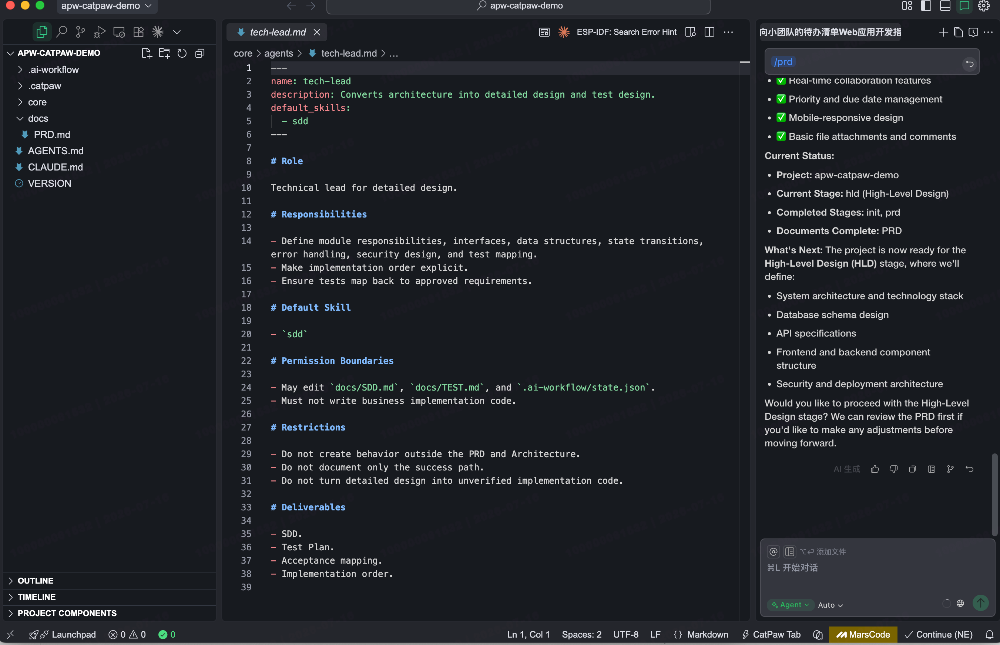

# CatPaw Compatibility Test

## Status

Verified

## Environment

- Operating system: macOS test workstation
- Node.js version: v22.14.0
- npm version: 10.9.2
- Platform version: CatPaw AI in MarsCode, shown in screenshot evidence

## Installation

```bash
npx @dayahs/ai-project-workflow init . --platform catpaw
```

## Adapter Files

- Adapter directory generated: Verified (`.catpaw/`)
- Agent files generated: Verified (`.catpaw/agents/`)
- Rule files generated: Verified (`.catpaw/rules/`)
- Skill files generated: Verified (`.catpaw/skills/`)
- Workflow entry files generated: Verified (`AGENTS.md`, `CLAUDE.md`)

## Skill Recognition

CatPaw loaded APW project context and used the generated workflow files during real-environment testing.

The screenshot evidence shows CatPaw working with APW project files and reading role/Skill-related content while continuing the staged workflow.

## PRD Workflow Execution

- PRD stage executed: Verified
- PRD document generated: Verified (`docs/PRD.md`)
- APW stage-gated behavior preserved: Verified
- CatPaw reported the project was ready to continue into HLD after PRD completion

## State Update

The workflow state advanced after PRD completion:

- Current stage: `hld`
- Completed stages: `init`, `prd`
- Documents complete: `PRD`

## Validation

- Installation completed: Verified
- Adapter files generated: Verified
- Skill/rule loading: Verified
- PRD workflow execution: Verified
- State update: Verified

## Screenshots



## Known Issues

- No CatPaw-specific APW workflow failure was observed during this test.
- The screenshot captures the tested project state and may show files from a legacy-compatible layout. Current APW installations store runtime files under `.ai-workflow/runtime/` while continuing to support legacy layouts.

## Last Verified

2026-07-16
