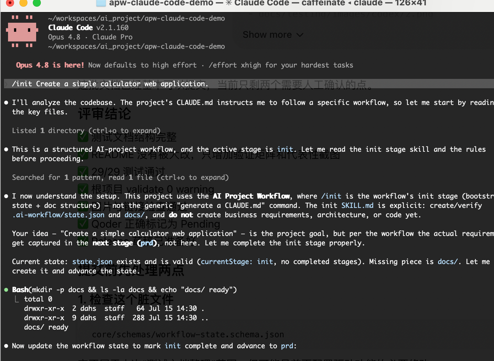
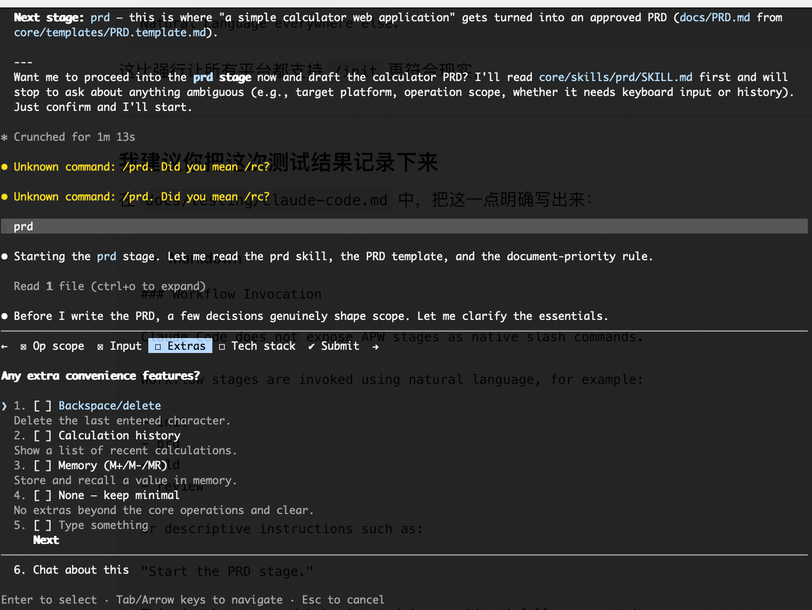

# Claude Code Compatibility Test

## Status

Verified

## Environment

- Operating system: macOS test workstation
- Node.js version: v22.14.0
- npm version: 10.9.2
- Platform version: Latest available version at test time

## Installation

```bash
npx @dayahs/ai-project-workflow@0.2.0 init . --platform claude-code
```

## Workflow Verification

- Installation completed: Verified
- Adapter directory generated: Verified (`adapters/claude-code/`)
- Workflow entry file generated: Verified (`CLAUDE.md`, `AGENTS.md`)
- init stage executed: Verified
- prd stage executed: Verified
- state updated: Verified (`.ai-workflow/state.json`)
- validate passed: Verified

## Workflow Invocation

Claude Code successfully loads the APW project instructions, Skills, templates, and workflow state.

Claude Code does not expose APW stages as native slash commands in this test environment. For example, `/prd` returned an unknown-command message.

The workflow was successfully triggered using natural-language stage instructions:

```text
prd
```

Claude Code then:

- read `core/skills/prd/SKILL.md`
- read the PRD template and document-priority rules
- entered the PRD stage
- asked clarifying questions before generating the document
- preserved the stage-gated workflow behavior

This is an expected platform interaction difference, not a workflow failure.

## Results

Claude Code completed real-environment workflow verification through the APW entry files and shared `core/` Skills. The tested flow completed init, then entered PRD through natural-language stage invocation.

## Screenshots





## Known Issues

- Native APW slash commands were not recognized in this test environment.
- Use natural-language stage instructions such as `prd`, `start the PRD stage`, or `execute the PRD workflow`.

## Last Verified

2026-07-15
