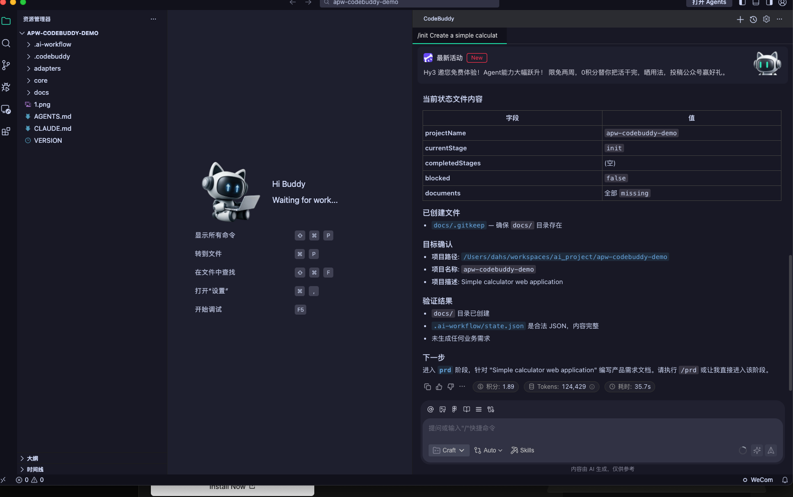
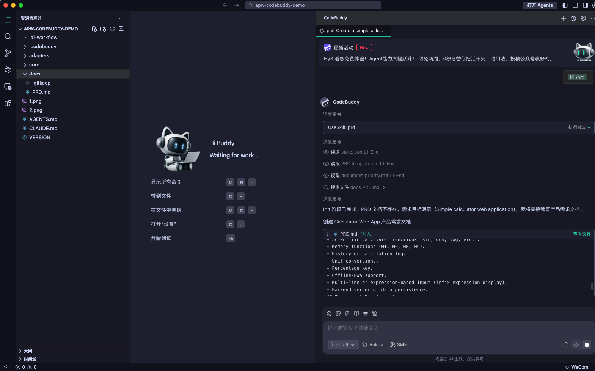

# CodeBuddy Compatibility Test

## Status

Verified

## Environment

- Operating system: macOS test workstation
- Node.js version: v22.14.0
- npm version: 10.9.2
- Platform version: Latest available version at test time

## Installation

```bash
npx @dayahs/ai-project-workflow@0.2.0 init . --platform codebuddy
```

## Workflow Verification

- Installation completed: Verified
- Adapter directory generated: Verified (`.codebuddy/`, `adapters/codebuddy/`)
- Workflow entry file generated: Verified (`AGENTS.md`, `CLAUDE.md`)
- init stage executed: Verified
- prd stage executed: Verified
- state updated: Verified (`.ai-workflow/state.json`)
- validate passed: Verified

## Results

CodeBuddy recognized generated Skills and Commands during real-environment testing.

## Screenshots






## Known Issues

- CodeBuddy support uses a minimal compatibility adapter and can fall back to root `AGENTS.md`.

## Last Verified

2026-07-15
