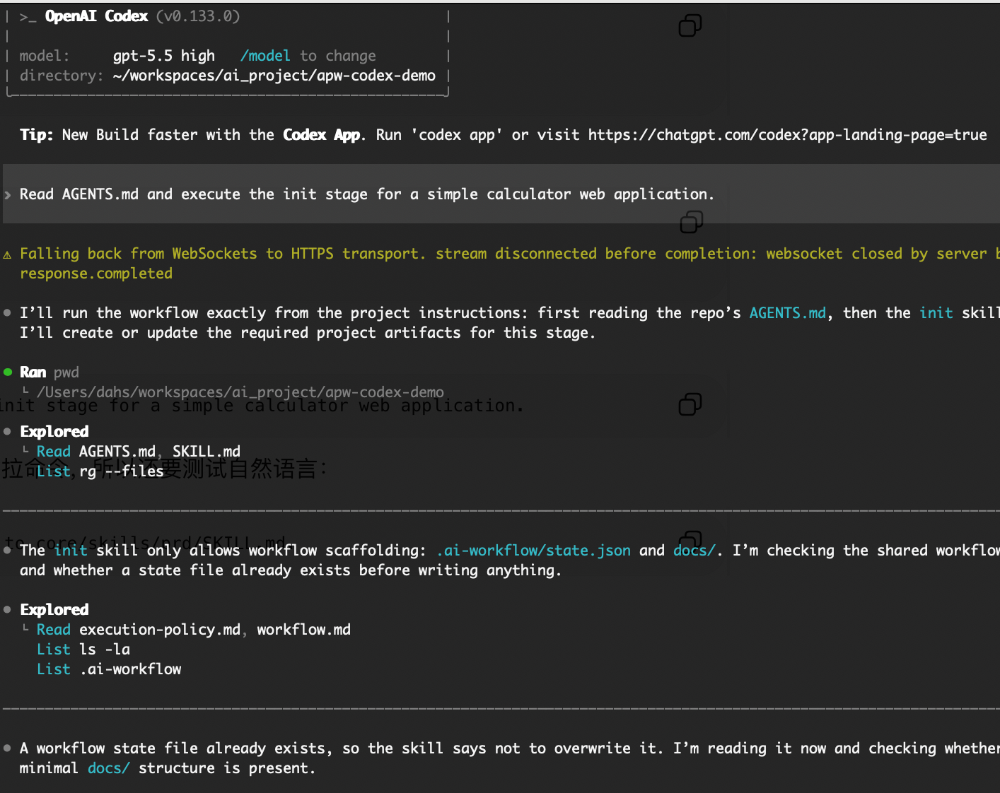
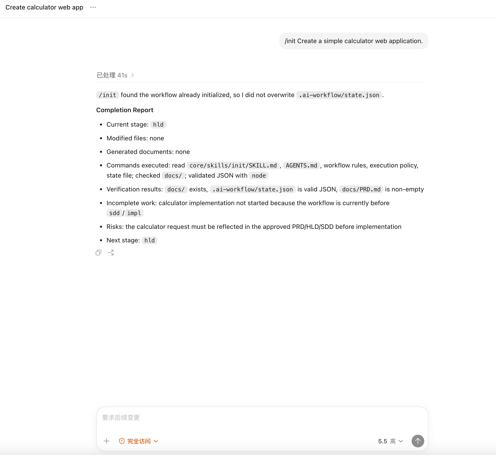
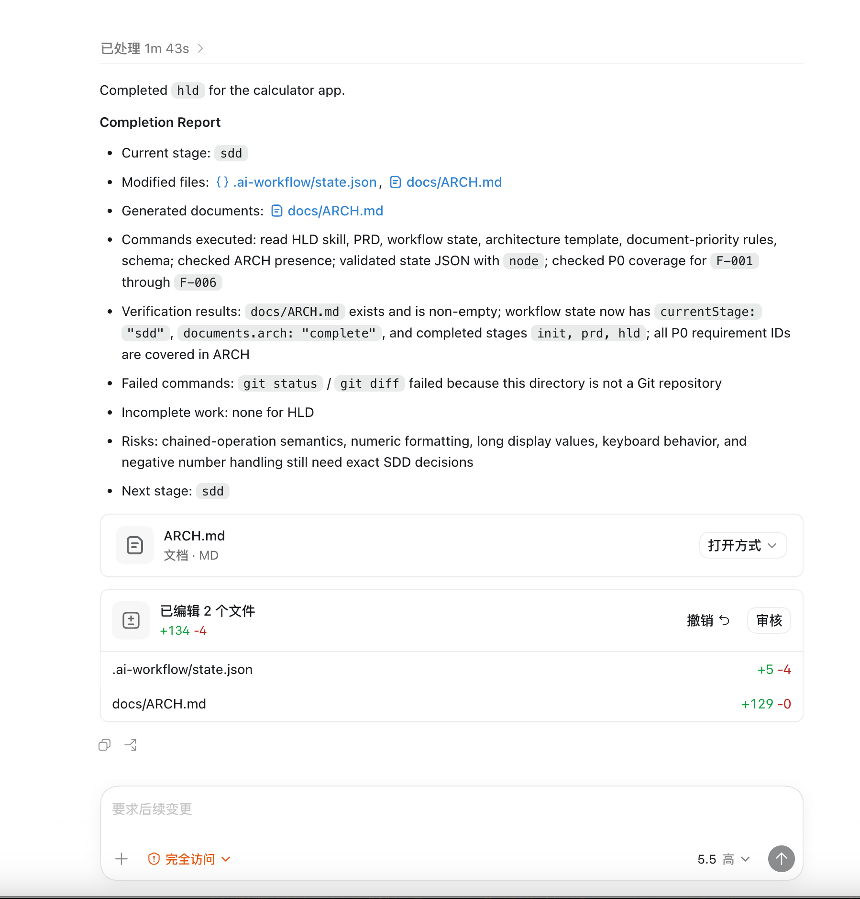

# Codex CLI Compatibility Test

## Status

Verified

## Environment

- Operating system: macOS test workstation
- Node.js version: v22.14.0
- npm version: 10.9.2
- Platform version: Codex CLI v0.133.0, shown in screenshot evidence

## Installation

```bash
npx @dayahs/ai-project-workflow@0.2.0 init . --platform codex
```

## Workflow Verification

- Installation completed: Verified
- Adapter directory generated: Verified (`adapters/codex/`)
- Workflow entry file generated: Verified (`AGENTS.md`)
- init stage executed: Verified
- prd stage executed: Verified
- state updated: Verified (`.ai-workflow/state.json`)
- validate passed: Verified

## Results

Codex CLI read the APW entry instructions, executed the workflow stages, updated project documents, and reported verification details.

## Screenshots







## Known Issues

- The captured Codex run reported that `git status` and `git diff` failed inside a non-Git demo directory. This did not block workflow validation.

## Last Verified

2026-07-15
