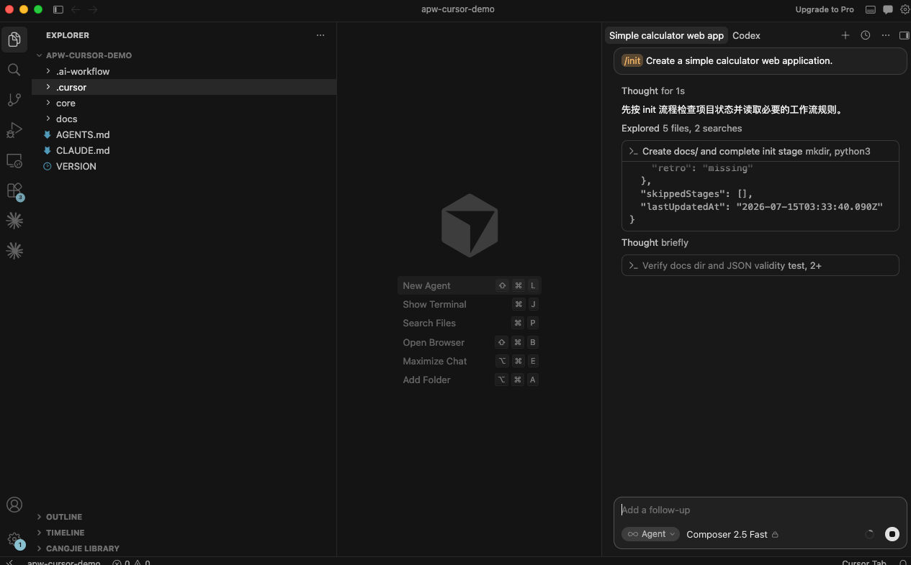
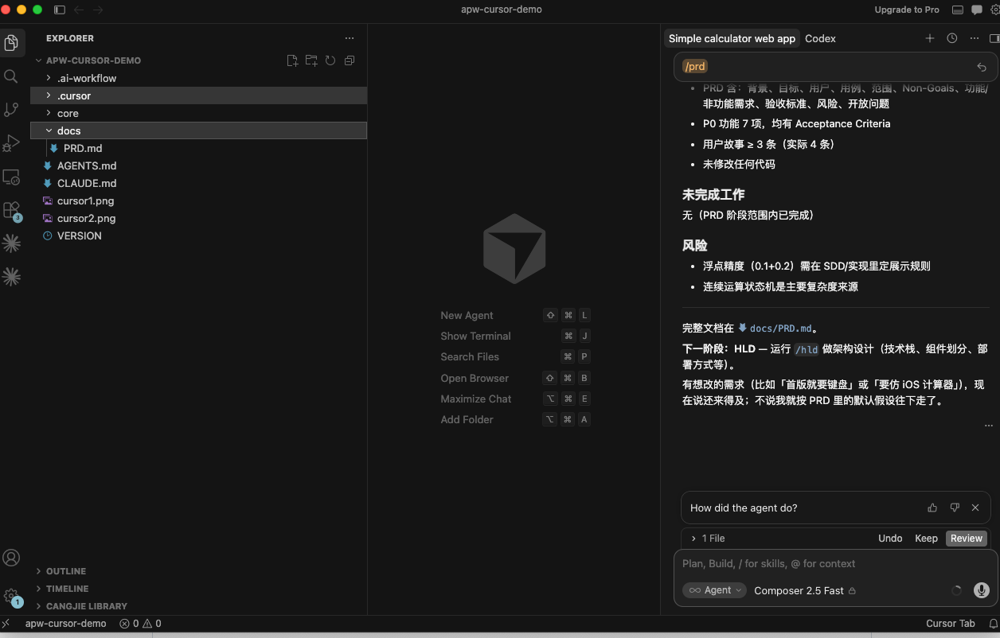

# Cursor Compatibility Test

## Status

Verified

## Environment

- Operating system: macOS test workstation
- Node.js version: v22.14.0
- npm version: 10.9.2
- Platform version: Latest available version at test time

## Installation

```bash
npx @dayahs/ai-project-workflow@0.2.0 init . --platform cursor
```

## Workflow Verification

- Installation completed: Verified
- Adapter directory generated: Verified (`.cursor/`)
- Workflow entry file generated: Verified (`AGENTS.md`, `CLAUDE.md`, `.cursor/rules/ai-sdd.mdc`)
- init stage executed: Verified
- prd stage executed: Verified
- state updated: Verified (`.ai-workflow/state.json`)
- validate passed: Verified

## Results

Cursor loaded the generated project files and followed the APW stage workflow. The captured run shows init-stage completion, state validation, and transition guidance for the PRD stage.

## Screenshots






## Known Issues

- Enforcement remains prompt-based; users may still need to point the agent back to `AGENTS.md` or the active Skill if it drifts.

## Last Verified

2026-07-15
