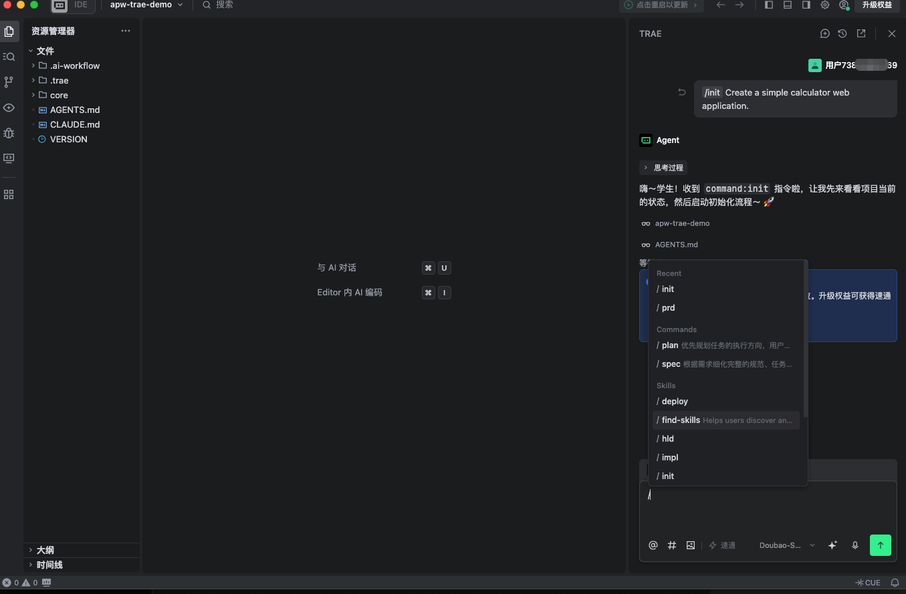
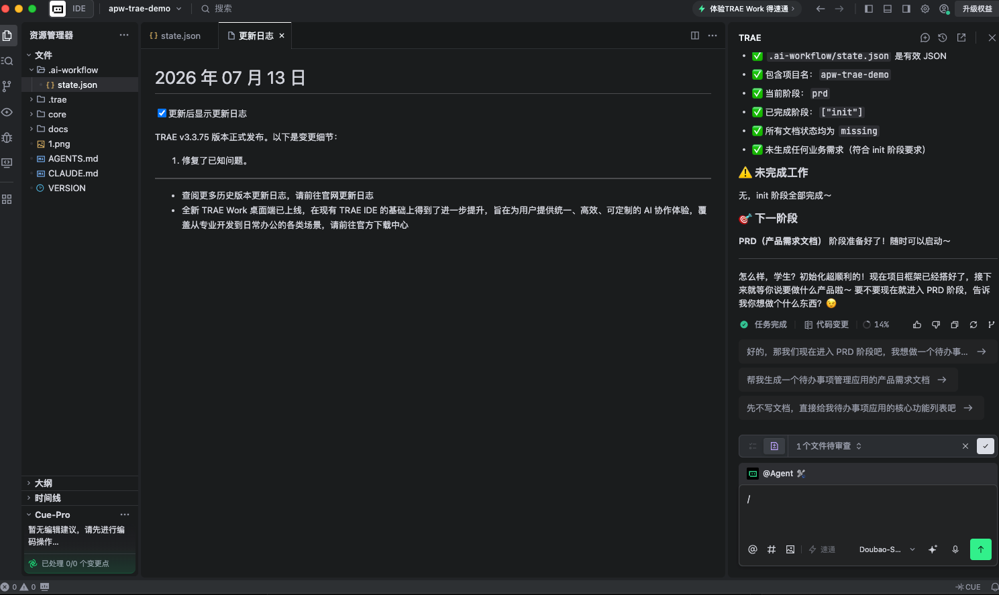

# TRAE Compatibility Test

## Status

Verified

## Environment

- Operating system: macOS test workstation
- Node.js version: v22.14.0
- npm version: 10.9.2
- Platform version: TRAE v3.3.75, shown in screenshot evidence

## Installation

```bash
npx @dayahs/ai-project-workflow@0.2.0 init . --platform trae
```

## Workflow Verification

- Installation completed: Verified
- Adapter directory generated: Verified (`.trae/`)
- Workflow entry file generated: Verified (`.trae/rules.md`, `AGENTS.md`, `CLAUDE.md`)
- init stage executed: Verified
- prd stage executed: Verified
- state updated: Verified (`.ai-workflow/state.json`)
- validate passed: Verified

## Results

TRAE recognized the generated stage commands and reported workflow state checks during real-environment testing.

## Screenshots





## Known Issues

- TRAE custom agents are configured through its UI; generated agent files may need to be pasted or referenced according to the active TRAE version.

## Last Verified

2026-07-15
